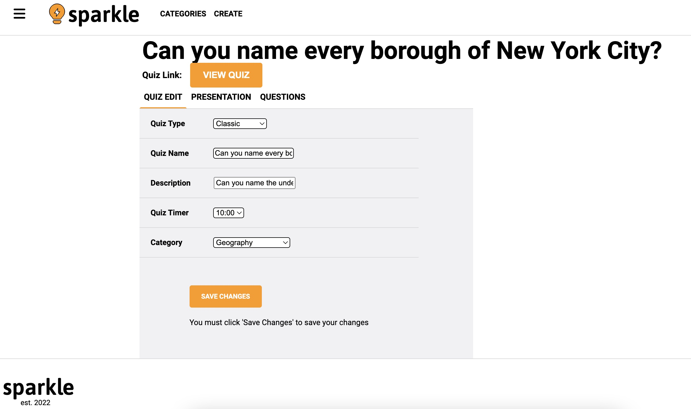

# Sparkle

## What is Sparkle?
This app is a clone of [Sporcle](https://www.sporcle.com/), the online quiz website.
With this app, users can both and create and take quizzes. Logged in users can do both, while guests of the site can only view quizzes. Logged in users can also comment on quizzes and like or dislike comments.
Enjoy [Sparkle](https://sparkle-sporcle.herokuapp.com/) at your leisure!

## Technologies 
To build Sparkle, I used Ruby on Rails for the backend database. I used the React functional component framework and Redux store to manage the frontend. In addition, I used AWS inegration to enable users to upload images to quizzes.

## Features
1. User Authentication
Sparkle users are able to both sign up and log in to Sparkle, and their information will be stored in the backend database. At the login page, users are presented with a login modal. The user can toggle the modal depending on if they have an account or not.


2. Posting a Quiz
In addition to being able to view and take quizzes, users can submit and edit their own quizzes to Sparkle for other Sparklers to enjoy. This required not only the CRUD functionality for a "quiz" entity but also the CRUD functionality for individual questions that are each associated with a quiz through a foreign key pointing to the quiz ID. Every individual question is posted to the backend database when added through the quiz form. 



## Code Snippet
Below is the code used to determine if an input answer was correct, as well as if a test is complete. This was particularly complicated as each question is its own item in a database, and each question tile is being rendered as its own component separate from the quiz. This required that I send props with information about the quiz to the question tile, as well as a state-setter method in order to update the quiz score.

``` const QuestionTile = ({question, setScore, inputVal, setInputVal}) => {

    useEffect(() => {
        if (inputVal === question.answer) {
            setScore(prevScore => prevScore + 1)
            setInputVal("")
            let answer = document.getElementById(question)
            document.getElementById("revealed-answer").className="hidden"
            answer.className=("revealed-answer")
            
        }
    }, [inputVal])
}
```

This next snippet shows how the question tiles are all rendered on a question index page (which in turn is rendered on its quiz show page):
```
useEffect(() => {
        if (score === quiz.maxScore || time === 0) {
            const quizTake = {takerId: sessionUser ? sessionUser.id : null, quizId: quizId, score: score, time: time }
            console.log("creating quiz take")
            dispatch(createQuizTake(quizTake))
        }
    }, [score])

    useEffect(() => {
        questions.forEach(q => {
            if (Object.values(q)[2].toLowerCase() === inputVal.toLowerCase() && !usedAnswers.includes(Object.values(q)[2])) {
                setScore(score + 1)
                setInputVal("")
                let answer = document.getElementById(Object.values(q)[0])
                answer.className = "revealed-answer"
                setUsedAnswers(prev => prev + [Object.values(q)[2]])
            }
        })
    }, [inputVal])
```

## Future Features
Future features will include
* Deleting comments
* User profile pictures
* Search and filter functionality on both quizzes and users
